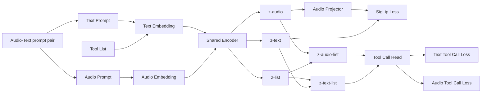
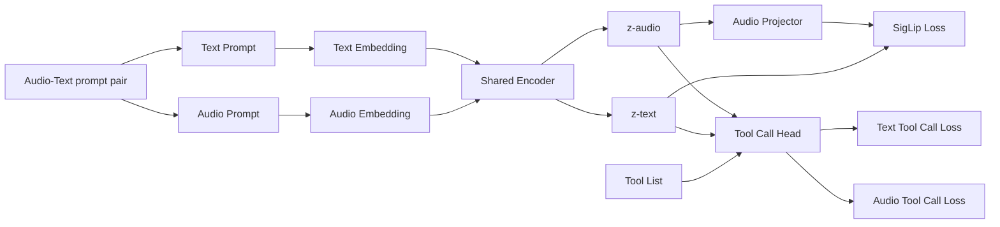
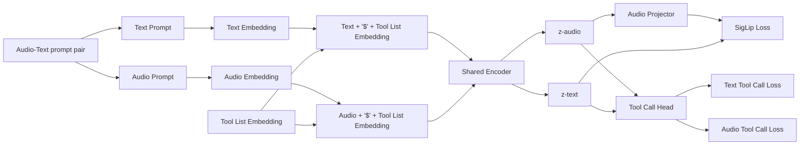

## Transcription Training

## Audio-Text Tool call training V1

## Audio-Text Tool call training V2

## Audio-Text Tool call training V3

Audio transcription training and tool call training can be done at the same time, while the Audio tool call training should be done separately at the end.