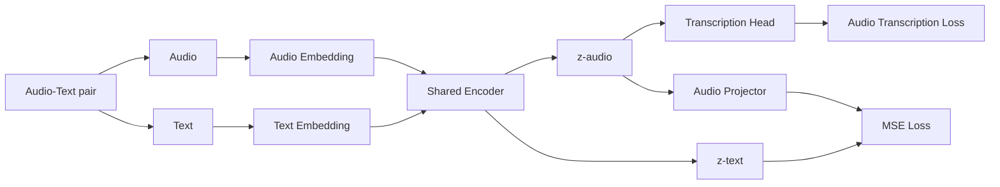
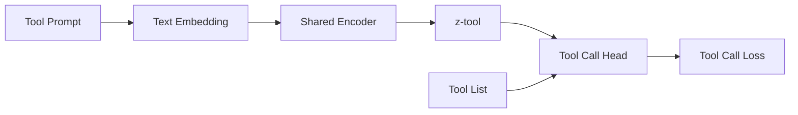
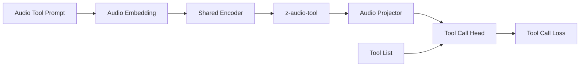

## Transcription Training

```mermaid
graph LR
    %% Inputs
    AT_pair[Audio-Text pair] --> A_in[Audio]
    AT_pair --> T_in[Text]
    A_in --> A_emb[Audio Embedding]
    T_in --> T_emb[Text Embedding]

    %% Embeddings to Encoder
    A_emb --> Enc[Shared Encoder]
    T_emb --> Enc

    %% Encoder to Latents
    Enc --> ZA[z-audio]
    Enc --> ZT[z-text]

    %% Audio Transcription Branch
    ZA --> Tr_dec[Transcription Head]
    Tr_dec --> A_loss[Audio Transcription Loss]

    %%  Contrastive Alignment Branch
    ZA --> Proj[Audio Projector]
    Proj --> C_loss[MSE Loss]
    ZT --> C_loss
```

## Tool call training

```mermaid
graph LR
    %% Inputs
    Tool_in[Tool Prompt] --> T_emb[Text Embedding]

    %% Embeddings to Encoder
    T_emb --> Enc[Shared Encoder]

    %% Encoder to Latents
    Enc --> ZTool[z-tool]

    %% Tool Call Branch
    ZTool --> Tool_dec[Tool Call Head]
    ToolList[Tool List] --> Tool_dec
    Tool_dec --> Tool_loss[Tool Call Loss]
```

## Audio tool call training

```mermaid
graph LR
    %% Inputs
    Tool_in[Audio Tool Prompt] --> T_emb[Audio Embedding]

    %% Embeddings to Encoder
    T_emb --> Enc[Shared Encoder]

    %% Encoder to Latents
    Enc --> ZTool[z-audio-tool]
    ZTool --> Proj[Audio Projector]

    %% Tool Call Branch
    Proj --> Tool_dec[Tool Call Head]
    ToolList[Tool List] --> Tool_dec
    Tool_dec --> Tool_loss[Tool Call Loss]
```