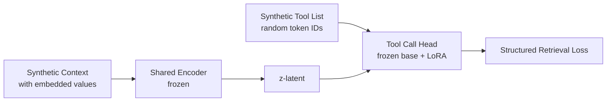
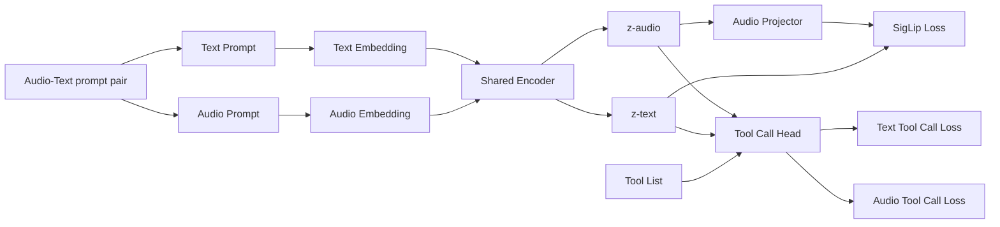

## Stage 0: Induction Head Pre-training (Tool Call Head Warm-up)

Before training the tool call head on real tool data, we pre-train it on synthetic structured retrieval tasks to teach the mechanical skill of deterministic symbol lookup and copying — the core operation of tool calling.

### Motivation

Two recent results motivate this stage:

1. **Formal language pre-pretraining transfers to natural language** ([Chiang et al., ACL 2025](https://aclanthology.org/2025.acl-long.478.pdf)): Pre-training a transformer on hierarchically structured formal languages (k-Shuffle Dyck) before natural language training provides positive transfer, particularly for *verbatim retrieval*. 500 steps of formal language pre-pretraining can replace ~4000 steps of natural language training (MRS ≈ 8). Crucially, the copy language $ww$ does *not* help — hierarchical structure with cross-serial dependencies is key.

2. **Random embeddings accelerate induction head formation** ([Liu, 2026](https://kindxiaoming.github.io/blog/2026/sparse-attention-8/)): Resampling token embeddings at each training step forces the model to learn symbolic (pattern-based) attention patterns rather than memorizing numeric correlations. This dramatically accelerates the formation of induction heads that implement the abstract rule $[A][B]\ldots[A] \rightarrow [B]$ regardless of token identity.

### Why this helps tool calling

Tool calling is fundamentally structured associative recall with hierarchical dependencies:
- **Level 1** (tool selection): Match intent in context to one of $K$ tools — analogous to bracket matching in k-Shuffle Dyck
- **Level 2** (argument filling): For each argument of the selected tool, locate and copy the correct value from context — cross-serial dependency retrieval

By pre-training on synthetic data with random embeddings, the head learns the *symbolic pattern* of retrieval (attend to the right key in the list, copy it exactly, fill the value) independently of what specific tokens represent. The latent-based conditioning (which tool to actually call given the audio/text input) is then learned naturally during real tool call training.

### Curriculum with decaying embedding noise

| Phase | Steps | Tools | Args | Embedding noise | Notes |
|-------|-------|-------|------|-----------------|-------|
| 0a | ~500 | 2 | 1 each | Fully random (resample each step) | Pure symbolic learning |
| 0b | ~500 | 5 | 2–3 | Fully random | Scale up retrieval complexity |
| 0c | ~1000 | 10 | 2–5 | Gaussian $\sigma$: 1.0 → 0.3 | Values in natural context, distractors |
| 0d | ~500 | Full | 2–5 | Gaussian $\sigma$: 0.1 | Transition to real embedding geometry |

At each step, tool/argument names are drawn from random token IDs (or the embedding matrix is resampled). A synthetic context is generated containing the values for arguments of one tool, embedded in distractor text. The target is the structured output selecting the correct tool and filling in the correct arguments. **Constrained decoding is used during pre-training** to match the final tool call generation setup.

### LoRA adapter strategy

The tool call head is initialized from the pretrained text reconstruction head. To preserve text generation capability while learning the retrieval circuit:
1. Freeze the base weights (text reconstruction head)
2. Attach LoRA adapters (rank $r$) to the attention projections
3. Train only the LoRA parameters on the synthetic retrieval task
4. After Stage 0: merge LoRA weights into the base weights, producing a head with both text generation and retrieval capabilities baked in
5. Proceed to real tool call training (Stage 2) with all weights unfrozen

---

## Transcription Training

## Audio-Text Tool call training

Audio transcription training and tool call training can be done at the same time, while the Audio tool call training should be done separately at the end.