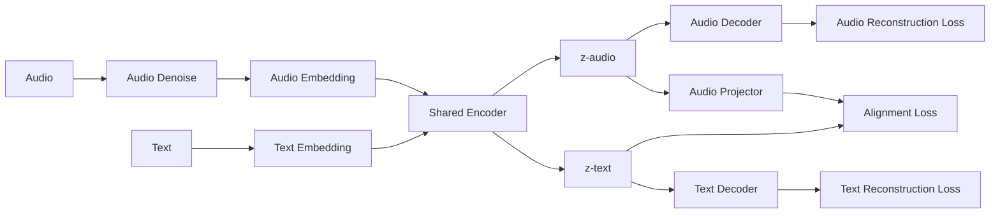

### Stage 1 (Unlabeled): Recon + Adversarial Alignment

Let $a \sim \mathcal{D}_a$ denote an audio sample and $x \sim \mathcal{D}_x$ denote a text sample (unpaired across datasets). A shared encoder $f_\theta(\cdot)$ maps either modality to a latent representation:
$$z_a = f_\theta(a), \qquad z_x = f_\theta(x).$$

We attach modality-specific reconstruction decoders:
$$\hat a = r_{\phi_a}(z_a), \qquad \hat x = r_{\phi_x}(z_x),$$
with reconstruction losses (chosen to match the underlying representation, e.g. $\ell_1/\ell_2$ for continuous targets or cross-entropy for discrete tokens):
$$\mathcal{L}_{\mathrm{rec\text{-}a}}(a) = \ell_a(\hat a, a), \qquad \mathcal{L}_{\mathrm{rec\text{-}x}}(x) = \ell_x(\hat x, x).$$

Taking expectations over the unlabeled datasets yields:
$$\mathcal{L}_{\mathrm{rec\text{-}a}} = \mathbb{E}_{a\sim \mathcal{D}_a}\!\left[\mathcal{L}_{\mathrm{rec\text{-}a}}(a)\right], \qquad \mathcal{L}_{\mathrm{rec\text{-}x}} = \mathbb{E}_{x\sim \mathcal{D}_x}\!\left[\mathcal{L}_{\mathrm{rec\text{-}x}}(x)\right].$$

To align the audio and text latent distributions while allowing audio-specific detail to be stripped, we introduce an audio projector $p_\psi(\cdot)$:
$$u_a = p_\psi(z_a).$$

We train a modality discriminator $d_\omega(\cdot)\in(0,1)$ to predict whether its input came from the audio pathway (label $1$ for $u_a$) or the text pathway (label $0$ for $z_x$). The discriminator is trained with binary cross-entropy:
$$\mathcal{L}_D(\omega) = \mathbb{E}_{a\sim \mathcal{D}_a}\!\left[-\log d_\omega(u_a)\right] + \mathbb{E}_{x\sim \mathcal{D}_x}\!\left[-\log\big(1-d_\omega(z_x)\big)\right].$$

Stage 1 training follows the standard minimax objective: reconstruction decoders (and the shared encoder) minimize reconstruction error, while the encoder/projector are trained adversarially to *fool* the discriminator. Let $\Theta=\{\theta,\phi_a,\phi_x,\psi\}$ denote parameters of the shared encoder, reconstruction decoders, and projector. We optimize:
$$\min_{\Theta}\;\max_{\omega}\;\; \mathcal{L}_{\mathrm{rec\text{-}a}} + \mathcal{L}_{\mathrm{rec\text{-}x}} \;-\;\lambda_{\mathrm{adv}}\,\mathcal{L}_D(\omega;\Theta),$$
where $\lambda_{\mathrm{adv}}\ge 0$ controls the strength of adversarial alignment.

## **Spec and Ablations**
1. **Audio Embedding**: There are essentially two options. First, we can take the raw waverform and and use convolutions on it Moonshine style to construct features. Second, we can generate the MEL bins and process them Whisper style. We can either do patches ViT style or again just conv over MEL Whisper style. The audio dataset we will be using is TBD (maybe granary), the audio will be prepared by augmenting it with slight natural noise, then we mask out different portions of the MEL bin and then the final prediction must be done to recreate the inital unmasked mel bins. 

2. **Audio Decoder**: The audio decoder that we will be using has to reconstruct the MEL bins. We will probably make everything fixed size, padded to 30s. The decoder is going to be a shallow non-causal transformer with learned positional embeddings as the initial query. The decoder has to be lightweight so that the encoder generates informative latents and handles most of the processing

3. **Text Embedding and Decoder**: This will be very standard, we will have a UL2 setup with a tokenizer and embedding layer, and then a standard transformer decoder. The text dataset we will be using is TBD (maybe FineWebEdu). We will have a minor adjustment to UL2, instead of predicting just the noised parts we will reconstruct the whole sequence, to match what the audio decoder is doing better. 

4. **Adversarial Alignment**: The discriminator will be something like a 2 layer MLP mixer taking in the matrix valued latent and outputting a number. We should either do a MLP mixer or a pool and then MLP to properly handle the matrixness of the latent. We might have to do a hyperparameter sweep directed towards getting the best update parameters for the discriminator. 

5. **Encoder**: The encoder will be a memory mixer like what we have implemented already.

6. **Audio Projector**: The audio projector will be a simple linear multiplication on the latent multiplying across the hidden dimension.

7. **Audio Denoise**: The denoiser will be pretrained according to [denoising.md](denoising.md) and then frozen during pretraining.

